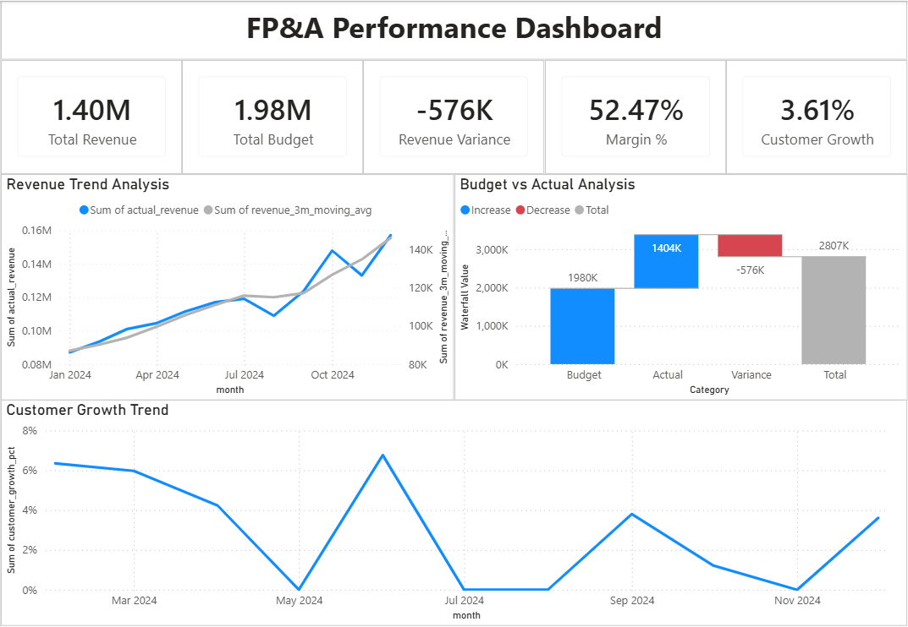

# FP&A Performance Dashboard

> A financial planning & analysis (FP&A) dashboard built using SQL and Power BI to analyze revenue performance, budget vs actual variance, profitability, and customer growth for a simulated B2B SaaS business.

---

## 🎯 Project Objective

This project simulates a real-world FP&A reporting system to support executive-level financial decision-making.

Key objectives:

- Track monthly revenue performance
- Compare actual vs budget financials
- Monitor profitability using margin KPI
- Analyze customer growth trends
- Provide executive-level KPI visibility

---

## 🛠️ Tech Stack

- Python (Synthetic data generation)
- SQL (Aggregation, KPI logic, time-series analysis)
- PostgreSQL (Data modeling & SQL transformations)
- Power BI (Dashboard development & visualization)

---

## 🧱 Data Architecture

The project follows a star-schema-inspired analytical model:

### Fact Tables
- `fact_transactions` (Revenue, Cost, Profit, Customer activity)
- `fact_budget` (Budgeted financials)

### Views / Data Marts
- `v_monthly_actual`
- `v_monthly_budget`
- `v_budget_vs_actual`
- `v_revenue_trend`
- `v_customer_growth`
- `v_fpna_mart`

### Dimensions
- `dim_date`
- `dim_region`
- `dim_plan`

---

## 📈 Key KPIs

- Total Revenue
- Budget Revenue
- Revenue Variance
- Profit Margin %
- Customer Growth %

---

## 📊 Dashboard Features

### Executive Overview
High-level KPI summary for financial performance tracking.

### Revenue Performance
- Monthly revenue trend
- 3-month moving average smoothing

### Budget vs Actual Analysis
- Variance analysis using waterfall visualization

### Customer Growth Analysis
- Monthly active customer growth trend

---

## 📸 Dashboard Preview

---

## 🧮 SQL Highlights

- Monthly aggregation of transactional data
- Budget vs actual variance calculation
- Rolling 3-month moving average
- Customer growth rate using LAG window function
- Profit margin computation

---

## 🧠 Key Insights

- Revenue peaked at $1.40M during the observed period
- Revenue was -$567K below budget expectations
- Profit margin remained stable at ~52%
- Customer growth showed consistent upward trend with periodic fluctuations

---

## 📝 Notes

- This project is fully simulated for portfolio purposes
- Focus is on FP&A modeling, KPI design, and dashboard storytelling
- Built using SQL-based transformations and Power BI visualization
